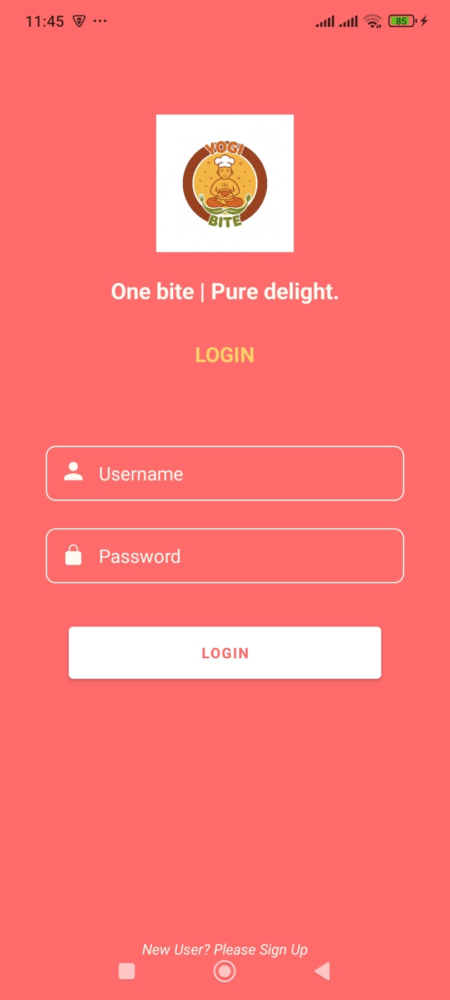
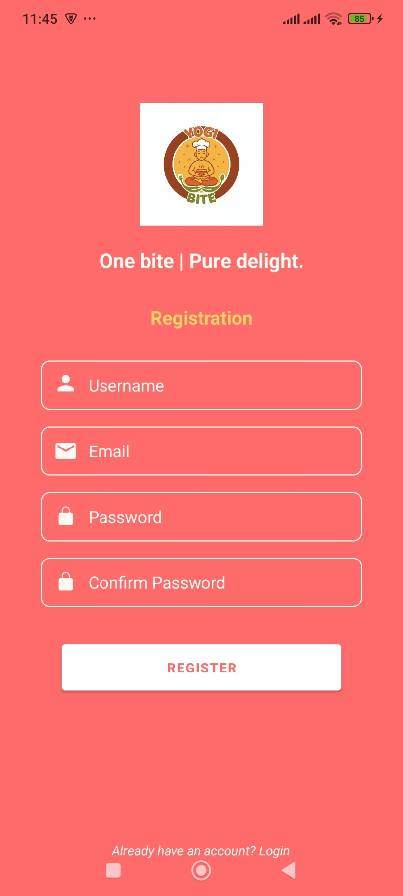
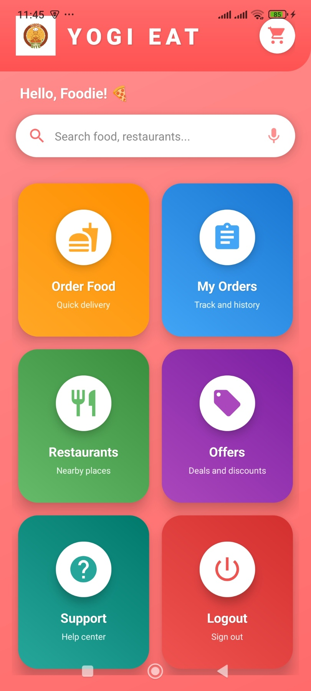
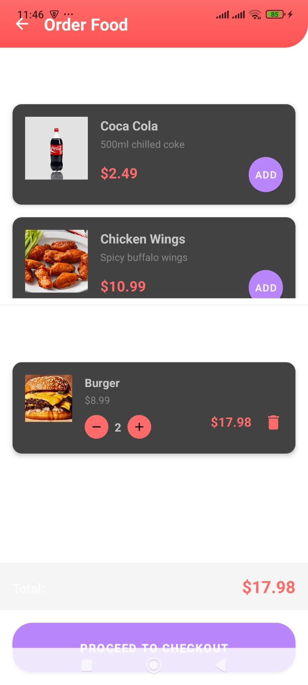
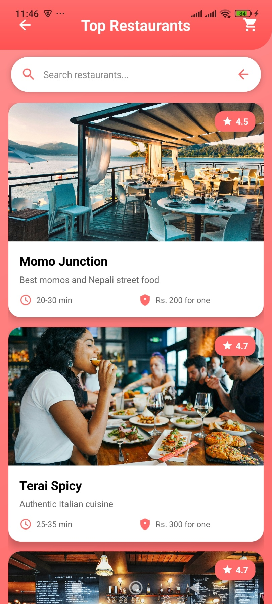
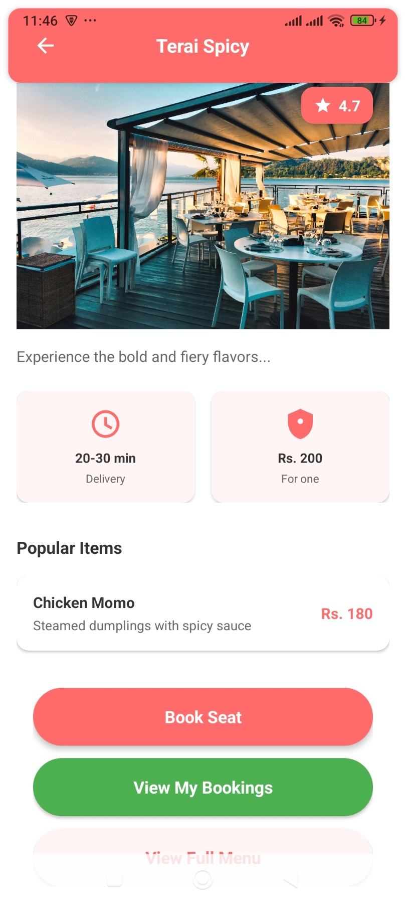
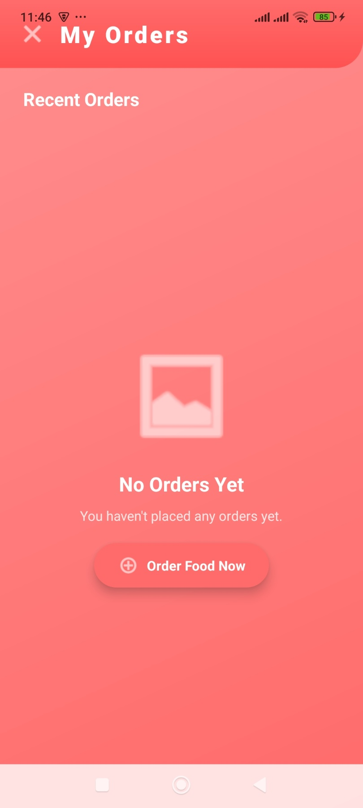
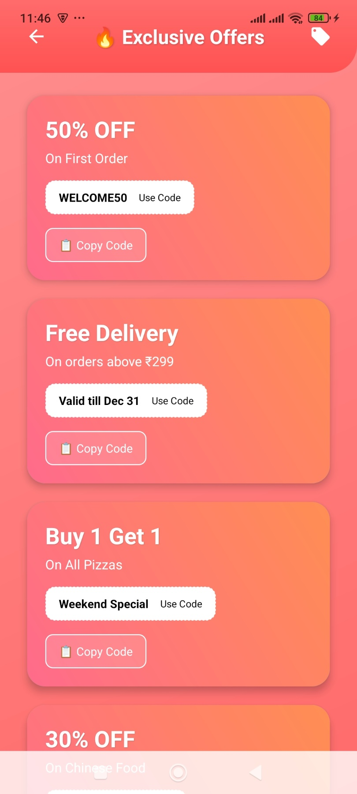
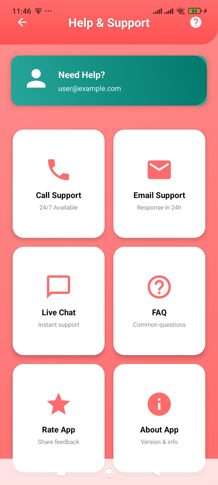

🍔 Food Ordering System (Android App)

An Android-based Food Ordering System developed using Java and SQLite.
The app allows users to sign up, log in, browse restaurants, order food, view offers, manage bookings, and get help & support through an intuitive mobile interface.

📱 App Features

🚀 Splash Screen

🔐 User Authentication

Login

Signup

🏠 Home Screen

Food categories

Featured items

🍽️ Order Food

⭐ Top Restaurants

📦 Booking & Order Management

🧾 My Orders

🎁 Offers & Discounts

🆘 Help & Support

🛠️ Technologies Used

Programming Language: Java

Database: SQLite

UI Design: XML

IDE: Android Studio

Architecture: Activity-based

🗂️ App Modules

Splash Screen

Login Module

Signup Module

Home Module

Order Food Module

Top Restaurants Module

Booking Module

My Orders Module

Offers Module

Help & Support Module

SQLite Database Handler

🖼️ App Screenshots

Screenshots taken from Android Emulator / Physical Device

### Splash Screen

### Login Screen

### Signup Screen

### Home Screen

### Order Food

### Top Restaurants

### Booking

### Booking (Step 2)

### My Orders

### Offers

### Help & Support

🗄️ Database Details (SQLite)

The app uses SQLite for local data storage.

Stored Data:

User Information

Food Items

Orders

Bookings

Offers

▶️ How to Run the Project

Clone the repository:

git clone https://github.com/your-username/food-ordering-system-android.git

Open the project in Android Studio

Let Gradle sync completely

Run the app on:

Android Emulator

OR Physical Android Device (USB Debugging enabled)

🎯 Future Enhancements

Online payment integration

Admin dashboard

Order tracking

Push notifications

Cloud database (Firebase / MySQL)

Rating & review system

👨‍💻 Author

Bibek Yogi

GitHub: https://github.com/BibekYogi6462

📄 License

This project is developed for educational and academic purposes.
